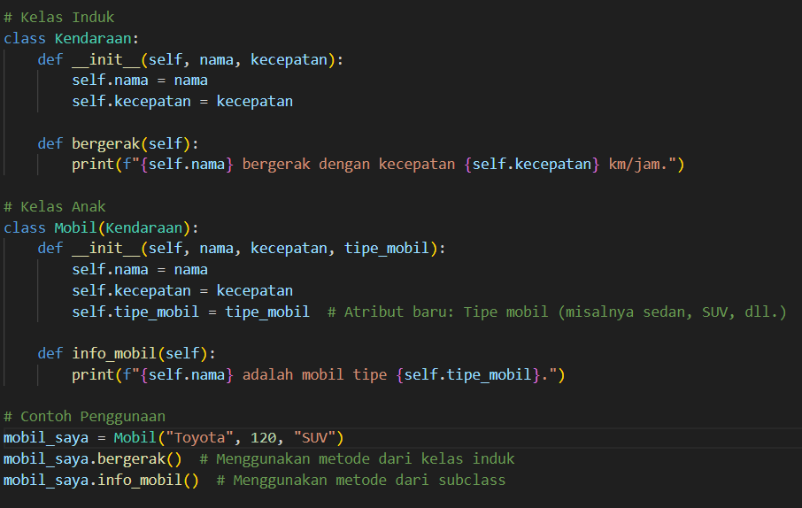

# Inheritance

Inheritance (pewarisan) adalah konsep dalam pemrograman berorientasi objek (OOP) yang memungkinkan sebuah kelas (child/anak) mewarisi properti dan metode dari kelas lain (parent/induk). Inheritance digunakan untuk meningkatkan reuse kode, membuat hubungan hierarkis antar kelas, dan memperluas fungsionalitas kelas induk.

## Contoh Inheritance (Pewarisan)

Ini adalah Contoh Inheritance Yang dimana ada pewarisan kelas tersebut.Sehingga Subclass Mobil mewarisi semua atribut dan metode dari kelas induk Kendaraan.

1. Kelas Induk : Kendaraan

   - Mendefinisikan atribut dasar (nama, kecepatan) dan metode umum (bergerak()), yang dapat digunakan oleh semua kendaraan.

2. Kelas Anak (Subclass) : Mobil
   - Mewarisi atribut dan metode dari Kendaraan.
   - Menambahkan atribut khusus (tipe_mobil).
3. Implementasi
   - Objek mobil_saya dibuat dari Mobil.
   - mobil_saya.bergerak() menggunakan metode dari induk.
   - mobil_saya.info_mobil() menggunakan metode dari subclass.

~supported By~

