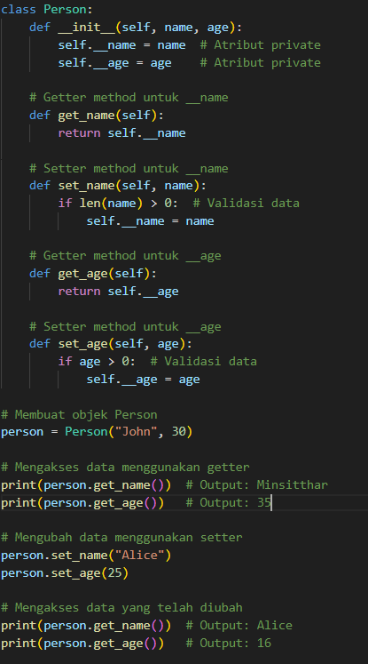

# Encapsulation

Encapsulation adalah salah satu prinsip dasar dalam pemrograman berorientasi objek (OOP). Konsep ini menyarankan agar data (atribut) dan metode (fungsi) yang beroperasi pada data tersebut dibungkus dalam satu unit atau objek.

Encapsulation Bertujuan Untuk :

- Melindungi data: Dengan membuat atribut kelas menjadi private atau tersembunyi, sehingga tidak bisa diakses langsung dari luar kelas. Akses ke data hanya dapat dilakukan melalui metode (getter dan setter).

- Mengontrol akses data: Menghindari perubahan data yang tidak sah atau tidak diinginkan dengan menyediakan cara terkontrol untuk mengakses dan memodifikasi data.

## Contoh Encapsulation

Penjelasan Pada Codingan Encapsulation.

1. Atribut Private

- Pada kelas Person, atribut **name dan **age diawali dengan dua garis bawah (\_\_) yang menandakan bahwa atribut tersebut private.
- Atribut private ini tidak dapat diakses langsung dari luar kelas. Ini adalah penerapan dari encapsulation, di mana data dibatasi aksesnya untuk mencegah perubahan langsung dari luar.

2. Metode Getter dan Setter
   - Getter: Metode get_name() dan get_age() digunakan untuk mengakses nilai atribut private **name dan **age.
   - Setter: Metode set_name() dan set_age() digunakan untuk mengubah nilai atribut **name dan **age. Dalam setter, kita juga menambahkan validasi untuk memastikan data yang diberikan benar (misalnya, nama tidak kosong dan usia lebih besar dari 0).
3. Konstruktor **init**(self, name, age):
   - Konstruktor digunakan untuk menginisialisasi objek dengan nilai name dan age yang diberikan saat objek dibuat. Nilai ini kemudian disimpan dalam atribut private name dan age.
4. Menggunakan Getter dan Setter:
   - Saat objek person dibuat, kita menggunakan getter get_name() dan get_age() untuk mendapatkan nilai dari atribut private \*\*name dan age.
   - Menggunakan setter set_name() dan set_age(), kita dapat mengubah nilai atribut private name dan age, dengan validasi terlebih dahulu.

## Keuntungan Encapsulation

- Keamanan Data: Data pribadi objek terlindungi dan hanya bisa diakses atau dimodifikasi melalui metode yang terkontrol.
- Kontrol Terhadap Akses Data: Setter memungkinkan untuk menambahkan logika validasi sebelum mengubah data, mencegah nilai yang tidak valid.
- Modularitas: Mempermudah pemeliharaan dan pengelolaan kode karena data dan fungsinya dibungkus dalam satu unit.
